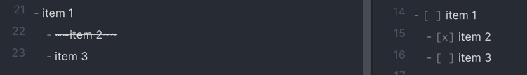
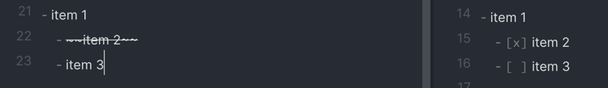

# tw2md
A small Java application to convert [TiddlyWiki](https://tiddlywiki.com/) Repositories to [Obsidian](https://obsidian.md/)
Vaults.

### Usage

```shell
java -jar tw2md.jar -h

java -jar tw2md.jar ~/Documents/tiddlywiki/myWiki ~/Documents/Obsidian/tiddlyWiki
```

### Rendering Tags

There are a bunch of options that apply to tag conversion because TiddlyWiki has a much more forgiving tag system

#### `--illegal-tag-character`, Obsidian only support alphanumeric tags plus 3 special characters (_-/) so most symbols are illegal, this
setting lets you configure that (default is '_').

e.g. `v1.2` => `#v1_2`

#### `--numeric-tag-prefix`, Obsidian does not support pure numeric tags, this lets you define a prefix for those tags, defaults to 't'. 

e.g. `1973` => `#t1973`

#### `--space-tag-character`, no spaces in Obsidian tags, this is the value to use instead (defaults to '-' but can be set to blank '')

e.g. `Cool Stuff` => `#Cool-Stuff`

#### `--tag-case-conversion`, case conversion options allowed:

- PASCAL, ThisIsPascalCase
- CAMEL, thisIsCamelCase
- UPPER, tags rendered as uppercase
- LOWER, tags rendered as lowercase
- NONE, no case conversion for tag names (default)

These can be combined with the `--space-tag-character` to create a wide variety of naming styles, some examples:

- Train case: `Cool Stuff` = --tag-case-conversion=CAMEL + --space-tag-character='' => `#coolStuff`
- Pascal case:`Cool Stuff` = --tag-case-conversion=PASCAL + --space-tag-character='' => `#CoolStuff`
- Snake case: `Cool Stuff` = --tag-case-conversion=LOWER + --space-tag-character='_' => `#cool_stuff`
- Kebab case: `Cool Stuff` = --tag-case-conversion=LOWER => `#cool-stuff`

### Checklists

TiddlyWiki does not support checklists, Obsidian does.  I often use bullet lists and then strike out items as I do them so converting
those to proper check boxed list items was helpful.

#### `--detect-checklists` setting this flag will render bullet/number lists as checklists if they contain a row that has been
fully struck out.



#### `--detect-checklist-headers` adding this flag will not render checkboxes for bullet list items that have indented children.



### Adding document titles

#### `--add-titles` will add the TiddlyWiki header value to the top of all documents when they are rendered.

#### `--add-titles-tag` can be used to add the header to the top of documents that have been tagged with a specific tag, I have tons of
quotes that rendered well in the TiddlyWiki UI but not so nicely in Obsidian, this solved that issue

e.g. `--add-titles-tag=quote`

### Organizing files

#### `--assets-path`, organize any binary assets into a Vault subdirectory, this will include any text encoded assets saved as Tiddlers.

e.g. `--assets-path=/System/Assets`

#### `--map-tag` / `-m`, map tags into Vault directories.

e.g. `-mJournal=Journal/Daily` will save any Journal tagged documents into the Vault under Journal/Daily. 

### Help Message

```shell
Usage: tw2md [-hV] [--add-titles] [--detect-checklist-headers]
             [--detect-checklists] [--include-system-tiddlers]
             [--assets-path=<assetPath>]
             [--illegal-tag-character=<illegalTagCharacterReplacement>]
             [--numeric-tag-prefix=<numericTagPrefix>]
             [--space-tag-character=<spaceTagCharacterReplacement>]
             [--tag-case-conversion=<tagCaseConversion>]
             [--tiddlywiki-assets-path=<tiddlyWikiAssetsPath>]
             [--add-titles-tag=<addTitlesForTags>]... [-m=<String=String>]...
             <sourceDirectory> <outputDirectory>
Convert TiddlyWiki files to Obsidian compatible markdown files.
      <sourceDirectory>     The root directory containing the tiddlyWiki
                              'tiddlers' directory.
      <outputDirectory>     The output directory were the Obsidian markdown
                              files will be saved.
      --add-titles          Add titles to the top of all output documents.
      --add-titles-tag=<addTitlesForTags>
                            Add titles to the top of documents when tagged with
                              this tag.
      --assets-path=<assetPath>
                            Collect assets into an Obsidian vault subdirectory,
                              path is relative to the output directory.
      --detect-checklist-headers
                            Do not add checkboxes to todo list items that have
                              indented sub-items.
      --detect-checklists   Treat lists that contain a struck out item as todo
                              lists.
  -h, --help                Show this help message and exit.
      --illegal-tag-character=<illegalTagCharacterReplacement>
                            Character used to replace illegal Obsidian tag
                              characters (Default: _).
      --include-system-tiddlers
                            Include system tiddlers in the output directory.
  -m, --map-tag=<String=String>
                            Map tiddlywiki tags into Obsidian vault
                              subdirectories.
      --numeric-tag-prefix=<numericTagPrefix>
                            Prefix added in front of numeric tiddlywiki tags
                              (Default: t).
      --space-tag-character=<spaceTagCharacterReplacement>
                            Character used to replace space characters used in
                              tiddlywiki tags (Default: -).
      --tag-case-conversion=<tagCaseConversion>
                            Convert tag case, can be combined with
                              `--space-tag-character`, valid values: PASCAL,
                              CAMEL, UPPER, LOWER, NONE
      --tiddlywiki-assets-path=<tiddlyWikiAssetsPath>
                            Include assets from another directory into the
                              Obsidian vault subdirectory, path is relative to
                              the tiddlywiki home directory.
  -V, --version             Print version information and exit.
```
